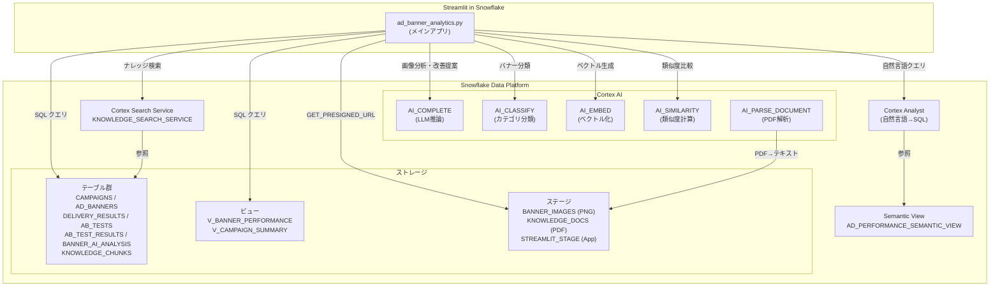
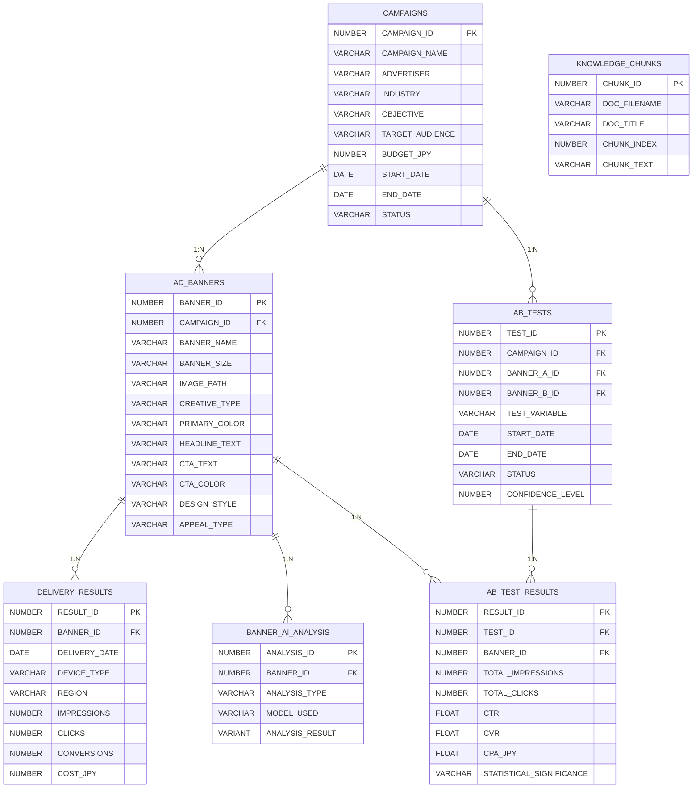

# 広告バナー分析ダッシュボード — Streamlit in Snowflake

Snowflake Cortex AI SQL 関数を活用した多角的な広告バナー分析アプリケーション。  
Streamlit in Snowflake (SiS) 上で動作し、ダッシュボード、A/B テスト分析、AI 画像分析、自然言語クエリ、改善提案、RAG ナレッジ検索の 6 機能を提供します。

---

## アーキテクチャ



---

## 機能一覧

### 1. ダッシュボード概要

キャンペーン全体または個別キャンペーンの KPI とトレンドを可視化するページ。

| 項目 | 内容 |
|---|---|
| KPI カード | 総インプレッション、クリック、CV、費用、平均 CTR、平均 CPA |
| 日別トレンド | Altair エリアチャート（指標切替: imp / click / CV / 費用 / CTR） |
| キャンペーン別表 | パフォーマンスサマリーテーブル |
| デバイス別内訳 | ドーナツチャート（MOBILE / DESKTOP / TABLET） |
| 地域別内訳 | 横棒グラフ（関東 / 関西 / 中部 / 九州 / 北海道・東北） |
| バナー別ランキング | CTR / CVR / CPA 等でソート可能なランキング表 |

**データソース:** `V_CAMPAIGN_SUMMARY`, `DELIVERY_RESULTS`, `AD_BANNERS`  
**裏側の仕組み:** SQL 集計クエリ → Pandas DataFrame → Altair チャート描画。`@st.cache_data(ttl=600)` で 10 分間キャッシュ。

---

### 2. A/B テスト分析

バナー間の A/B テスト結果を統計的有意性とともに比較するページ。

| 項目 | 内容 |
|---|---|
| テスト選択 | ドロップダウンで A/B テスト選択 |
| バナー比較表 | A/B 各バナーの imp・click・CV・CTR・CVR・CPA を横並び比較 |
| 統計的有意性 | p 値・信頼水準・勝者判定の表示 |
| 日別推移チャート | A/B 両バナーの CTR 日別推移を折れ線グラフで比較 |
| バナー画像表示 | A/B 両バナーの実画像を並列表示 |

**データソース:** `AB_TESTS`, `AB_TEST_RESULTS`, `DELIVERY_RESULTS`, `BANNER_IMAGES` ステージ  
**裏側の仕組み:** テスト定義からバナー ID を取得 → 配信結果を集計 → 信頼水準とp値で有意性判定。画像は `GET_PRESIGNED_URL()` で署名付き URL を取得し `st.image()` で表示。

---

### 3. AI 画像分析

Cortex AI SQL 関数を使ってバナー画像を多角的に自動分析するページ。

| 分析機能 | 使用 AI 関数 | 内容 |
|---|---|---|
| クリエイティブレビュー | `AI_COMPLETE` | バナー画像をマルチモーダル LLM に入力し、デザイン要素・訴求力・改善点をテキスト分析 |
| バナー分類 | `AI_CLASSIFY` | バナーを複数カテゴリ（訴求タイプ、デザインスタイル等）に自動分類 |
| 類似バナー検索 | `AI_EMBED` + `AI_SIMILARITY` | 選択バナーのベクトル埋め込みを生成し、他バナーとのコサイン類似度を計算して類似順にランキング |
| 要素抽出 | `AI_COMPLETE` | バナー画像から色、テキスト、CTA、レイアウト等の構成要素を構造化抽出 |

**データソース:** `AD_BANNERS`, `BANNER_IMAGES` ステージ  
**裏側の仕組み:** ステージ上の PNG 画像を `TO_FILE()` 経由で Cortex AI 関数に渡す。分析結果は `BANNER_AI_ANALYSIS` テーブルにキャッシュ可能。LLM レスポンスの `\\n` を `\n` に置換してから `st.markdown()` で表示。

---

### 4. 自然言語クエリ（Cortex Analyst）

日本語の自然言語でデータに問い合わせできるページ。

| 項目 | 内容 |
|---|---|
| 入力 | 自然言語テキスト（例：「関東のモバイルで CTR が最も高いバナーは？」） |
| 処理 | Cortex Analyst API → Semantic View 参照 → SQL 自動生成 → 実行 |
| 出力 | 生成 SQL の表示、クエリ結果テーブル、AI による結果サマリー |

**データソース:** `AD_PERFORMANCE_SEMANTIC_VIEW`（5 テーブルを統合した Semantic View）  
**裏側の仕組み:** Cortex Analyst REST API (`/api/v2/cortex/analyst/message`) にセマンティックビュー名と質問文を送信。Analyst がスキーマ定義（ディメンション・メトリクス・シノニム・コメント）を参照して SQL を自動生成。生成された SQL をそのまま実行し結果を表示。

**Semantic View の構成:**

| テーブル | 役割 |
|---|---|
| `CAMPAIGNS` | キャンペーンマスタ |
| `AD_BANNERS` | バナーマスタ |
| `DELIVERY_RESULTS` | 日別配信結果 |
| `AB_TESTS` | A/B テスト定義 |
| `AB_TEST_RESULTS` | A/B テスト結果 |

ディメンション 17 項目（キャンペーン名、業種、デバイス、地域 等）、メトリクス 12 項目（imp、click、CV、費用、CTR、CVR 等）を定義。各項目に日本語シノニムとコメントを付与。

---

### 5. 改善提案 AI アドバイザー

キャンペーンのパフォーマンスデータを基に、LLM がクリエイティブ・配信の改善提案を生成するページ。

| 項目 | 内容 |
|---|---|
| キャンペーン選択 | ドロップダウンでキャンペーン選択 |
| 分析テーマ | クリエイティブ改善 / ターゲティング / 予算配分 / 総合戦略 等 |
| RAG トグル | チェックボックスで社内ナレッジ参照の ON/OFF |
| 出力 | テーマに応じた具体的改善提案（数値根拠付き） |

**データソース:** `V_BANNER_PERFORMANCE`, `V_CAMPAIGN_SUMMARY`, `KNOWLEDGE_CHUNKS`（RAG 有効時）  
**裏側の仕組み:** キャンペーンの実績データを集計 → プロンプトに注入 → `AI_COMPLETE('claude-3-5-sonnet', prompt)` で改善提案を生成。RAG トグル ON 時は `Cortex Search Service` で類似ナレッジを検索し、上位 5 件のチャンクテキストをプロンプトに追加。提案履歴はセッション内で保持。

---

### 6. ナレッジベース RAG 分析

社内の過去分析レポート（PDF）をナレッジベースとして検索・活用するページ。

#### タブ 1: ナレッジ検索

| 項目 | 内容 |
|---|---|
| 入力 | 自由テキスト検索クエリ |
| 処理 | Cortex Search Service で類似度検索 |
| 出力 | 類似チャンク一覧（スコア付き、エキスパンダーで詳細表示） |

#### タブ 2: ナレッジ強化アドバイザー

| 項目 | 内容 |
|---|---|
| 入力 | キャンペーン選択 + 分析テーマ（5 種） |
| 処理 | ① テーマからクエリ自動生成 → ② Cortex Search でナレッジ検索 → ③ 実績データ+ナレッジをプロンプトに注入 → ④ AI_COMPLETE で分析 |
| 出力 | ナレッジに基づく具体的分析・提案 |

**データソース:** `KNOWLEDGE_CHUNKS`（19 チャンク / 5 PDF レポート）、`V_BANNER_PERFORMANCE`  
**裏側の仕組み:**

```
PDF (ステージ) → AI_PARSE_DOCUMENT(TO_FILE()) → テキスト抽出
    → SPLIT_TO_TABLE + LISTAGG → ~500文字チャンク → KNOWLEDGE_CHUNKS テーブル
    → Cortex Search Service (自動ベクトル化・インデックス)
    → SEARCH_PREVIEW() で類似度検索 → AI_COMPLETE で RAG 推論
```

**ナレッジ PDF 一覧:**

| ファイル | 内容 |
|---|---|
| `report_cosmetics_banner_optimization.pdf` | 化粧品 EC バナー広告改善レポート |
| `report_health_food_creative_analysis.pdf` | 健康食品 季節別クリエイティブ分析 |
| `report_fashion_ab_test_summary.pdf` | ファッション EC A/B テスト総括 |
| `report_travel_targeting_optimization.pdf` | 旅行予約サイト 地域ターゲティング最適化 |
| `report_finance_cpa_improvement.pdf` | 金融サービス CPA 改善事例集 |

---

## 使用 Snowflake 機能

| 機能 | 用途 |
|---|---|
| **AI_COMPLETE** | マルチモーダル画像分析、改善提案生成、RAG 推論 |
| **AI_CLASSIFY** | バナーカテゴリ自動分類 |
| **AI_EMBED** | バナー画像のベクトル埋め込み生成 |
| **AI_SIMILARITY** | ベクトル間のコサイン類似度計算 |
| **AI_PARSE_DOCUMENT** | PDF からのテキスト抽出（レイアウトモード） |
| **Cortex Analyst** | 自然言語→SQL 変換（Semantic View 経由） |
| **Cortex Search Service** | ナレッジチャンクの自動ベクトル化・類似度検索 |
| **Semantic View** | Cortex Analyst 用のスキーマ定義（ディメンション・メトリクス・シノニム） |
| **GET_PRESIGNED_URL** | ステージ上の画像ファイルへの署名付き URL 生成 |
| **TO_FILE** | ステージファイルを AI 関数に渡すためのファイル参照 |
| **Internal Stage** | バナー画像・PDF・アプリコードの格納 |
| **Stored Procedure** | ダミー配信データの自動生成 |

---

## データモデル



---

## ファイル構成

```
ad-banner-analytics/
├── ad_banner_analytics.py          # メインアプリ (Streamlit in Snowflake)
├── setup_ad_banner_analytics.sql   # テーブル・ダミーデータ・ビュー定義 SQL
├── setup_knowledge_base.sql        # ナレッジベース用ステージ・テーブル・Cortex Search 定義
├── ad_banner_semantic_view.sql     # Cortex Analyst 用 Semantic View 定義
├── generate_banners.py             # ダミーバナー画像生成スクリプト (Pillow)
├── generate_knowledge_pdf.py       # ダミーナレッジ PDF 生成スクリプト (fpdf2)
├── .gitignore
├── README.md
├── banners/                        # [生成物] バナー PNG 画像 (18枚)
│   ├── campaign1/
│   ├── campaign2/
│   ├── campaign3/
│   ├── campaign4/
│   └── campaign5/
├── knowledge_pdfs/                 # [生成物] ナレッジ PDF (5ファイル)
└── fonts/                          # [手動DL] NotoSansJP-Regular.ttf
```

> `banners/`, `knowledge_pdfs/`, `fonts/` は `.gitignore` で除外されています。再生成手順は下記セットアップを参照。

---

## セットアップ手順

### 前提条件

- Snowflake アカウント（Cortex AI 関数が利用可能なリージョン）
- [Snowflake CLI (`snow`)](https://docs.snowflake.com/en/developer-guide/snowflake-cli/index) インストール済み
- Python 3.11+
- pip パッケージ: `Pillow`, `fpdf2`

### 1. Snowflake オブジェクト作成

```sql
-- テーブル、ステージ、ダミーデータ、ビューを作成
-- setup_ad_banner_analytics.sql を Snowflake で実行
```

### 2. バナー画像の生成とアップロード

```bash
# ダミーバナー画像を生成
pip install Pillow
python generate_banners.py

# Snowflake ステージにアップロード
snow stage copy "banners/campaign1/*" "@DB.SCHEMA.BANNER_IMAGES/campaign1/" --overwrite
snow stage copy "banners/campaign2/*" "@DB.SCHEMA.BANNER_IMAGES/campaign2/" --overwrite
snow stage copy "banners/campaign3/*" "@DB.SCHEMA.BANNER_IMAGES/campaign3/" --overwrite
snow stage copy "banners/campaign4/*" "@DB.SCHEMA.BANNER_IMAGES/campaign4/" --overwrite
snow stage copy "banners/campaign5/*" "@DB.SCHEMA.BANNER_IMAGES/campaign5/" --overwrite
```

### 3. Semantic View 作成

```sql
-- Cortex Analyst 用の Semantic View を作成
-- ad_banner_semantic_view.sql を Snowflake で実行
```

### 4. ナレッジベース構築

```bash
# フォントダウンロード (PDF 生成に必要)
mkdir -p fonts
# Google Fonts から NotoSansJP-Regular.ttf をダウンロードして fonts/ に配置

# ナレッジ PDF 生成
pip install fpdf2
python generate_knowledge_pdf.py
```

```sql
-- ナレッジ用ステージ・テーブルを作成
-- setup_knowledge_base.sql を Snowflake で実行
```

```bash
# PDF を Snowflake にアップロード
snow stage copy "knowledge_pdfs/*" "@DB.SCHEMA.KNOWLEDGE_DOCS/" --overwrite
```

```sql
-- PDF をパースしてチャンクに分割
INSERT INTO KNOWLEDGE_CHUNKS (DOC_FILENAME, DOC_TITLE, CHUNK_INDEX, CHUNK_TEXT)
WITH parsed AS (
    SELECT
        RELATIVE_PATH AS FILENAME,
        REPLACE(REPLACE(RELATIVE_PATH, 'report_', ''), '.pdf', '') AS TITLE,
        AI_PARSE_DOCUMENT(
            TO_FILE('@KNOWLEDGE_DOCS', RELATIVE_PATH),
            {'mode': 'LAYOUT'}
        ):content::VARCHAR AS CONTENT
    FROM DIRECTORY('@KNOWLEDGE_DOCS')
    WHERE RELATIVE_PATH LIKE '%.pdf'
),
chunks AS (
    SELECT
        FILENAME, TITLE,
        s.INDEX AS CHUNK_INDEX,
        TRIM(s.VALUE) AS CHUNK_TEXT
    FROM parsed,
    LATERAL SPLIT_TO_TABLE(CONTENT, '\n\n') s
    WHERE LENGTH(TRIM(s.VALUE)) > 50
)
SELECT FILENAME, TITLE, CHUNK_INDEX, CHUNK_TEXT FROM chunks;

-- Cortex Search Service 作成
CREATE OR REPLACE CORTEX SEARCH SERVICE KNOWLEDGE_SEARCH_SERVICE
  ON CHUNK_TEXT
  ATTRIBUTES DOC_TITLE, DOC_FILENAME
  WAREHOUSE = COMPUTE_WH
  TARGET_LAG = '1 hour'
  AS (
    SELECT CHUNK_TEXT, DOC_TITLE, DOC_FILENAME, CHUNK_INDEX
    FROM KNOWLEDGE_CHUNKS
  );
```

### 5. アプリデプロイ

```bash
# Streamlit アプリをステージにアップロード
snow stage copy "ad_banner_analytics.py" "@DB.SCHEMA.STREAMLIT_STAGE/" --overwrite
```

```sql
-- Streamlit アプリ作成 (初回のみ)
CREATE STREAMLIT IF NOT EXISTS AD_BANNER_ANALYTICS_APP
  ROOT_LOCATION = '@DB.SCHEMA.STREAMLIT_STAGE'
  MAIN_FILE = 'ad_banner_analytics.py'
  QUERY_WAREHOUSE = 'COMPUTE_WH'
  TITLE = '広告バナー分析ダッシュボード';
```

---

## 技術スタック

| カテゴリ | 技術 |
|---|---|
| アプリケーション | Streamlit in Snowflake (Warehouse Runtime) |
| データウェアハウス | Snowflake |
| AI/ML | Snowflake Cortex AI SQL 関数, Cortex Analyst, Cortex Search |
| LLM | Claude 3.5 Sonnet (via AI_COMPLETE) |
| 可視化 | Altair |
| データ操作 | Pandas, Snowpark |
| バナー生成 | Pillow (Python Imaging Library) |
| PDF 生成 | fpdf2 + NotoSansJP フォント |
